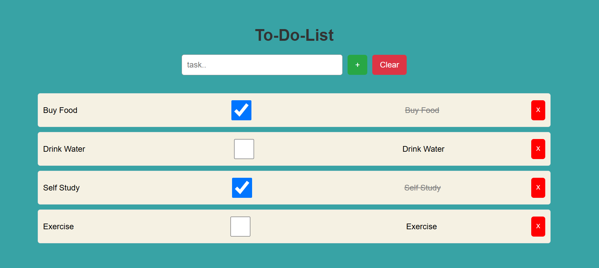

📝 To-Do List App

A simple To-Do List web application built using HTML, CSS, and JavaScript.

🚀 Features

- Add new tasks
- Mark tasks as completed
- Delete tasks
- Clear the input 

📸 Screenshot

Here is a preview of the To-Do List app:

📦 Technologies Used

- HTML
- CSS
- JavaScript

🛠️ How to Run

1. Clone the repository: git clone https://github.com/vandana-gariya/to-do-List
2. Open `index.html` in a browser.

✨ Author

- Vandana gariya – [GitHub](https://github.com/vandana-gariya)

